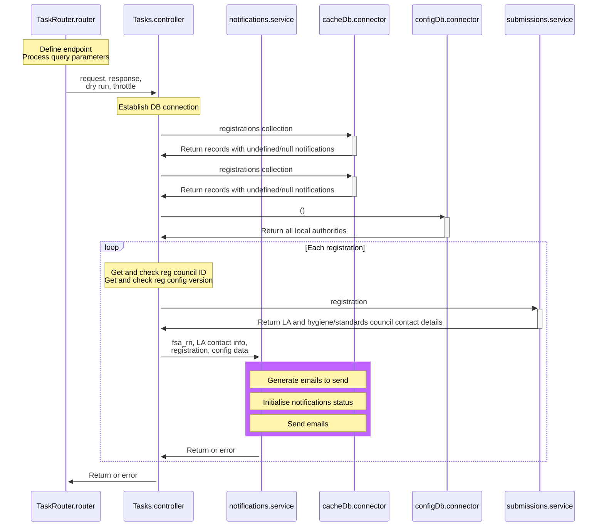

# Email notifications

Email notifications are sent asynchronously by the registration service in order that submissions from the front-end are not delayed. An application endpoint, `/bulk/sendnotification`, is defined in `src/api/tasks/TaskRouter.router.js`. This is called every few minutes by a logic app running in Azure and attempts to send emails for all registrations that have unsent or failed notifications, as recorded in the registration record itself.

## Process

A sequence diagram is shown below (if this doesn't display you need to install a Mermaid preview extension for VS Code).

The highlighted purple box is where the key functionality is and so are described in more detail below the diagram. Not all participants and sequences are shown to aid clarity.

### Generate Emails To Send

The `generateEmailsToSend` function, in `src/services/notifications.service.js`, gets the data required to send the emails from the contact info of the council and registration, and the template information from the configuration data. All data is passed into the function and was obtained from the database in previous steps in the process.

If the registration already has at least one notification status, the emails to send are based on these status items - the values are not regenerated from the LA/FBO data. This allows for easy resending of emails with corrected email addresses or additional emails that require sending.

### Initialise Notifications Status

The `initialiseNotificationsStatusIfNotSet` function, in `src/services/notifications.service.js`, initialises the notifications status in the database prior to email sending. If any notifications status already exists for the registration in the database, this function will do nothing. Otherwise, the statuses are created and marked as not being sent.

### Send Emails

The `sendEmails` function, in `src/services/notifications.service.js`, uses the data generated by the `generateEmailsToSend` function to send emails where the notification indicates they have not been sent or have previously failed. It updates the in-memory status object as it goes and then saves all updates for the registration notification status in one go after having sent all required notifications.
